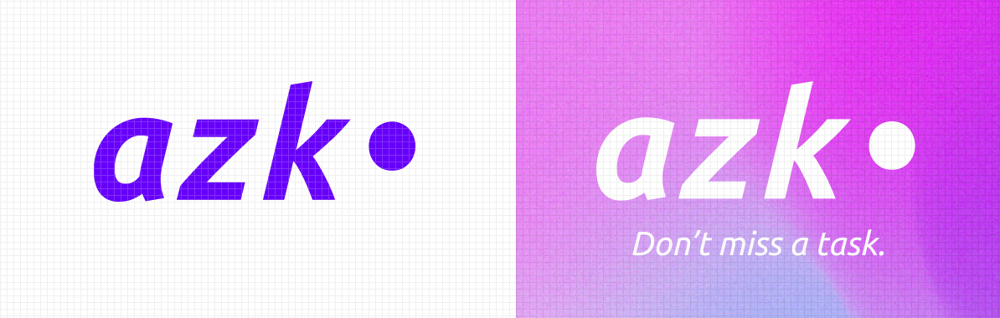
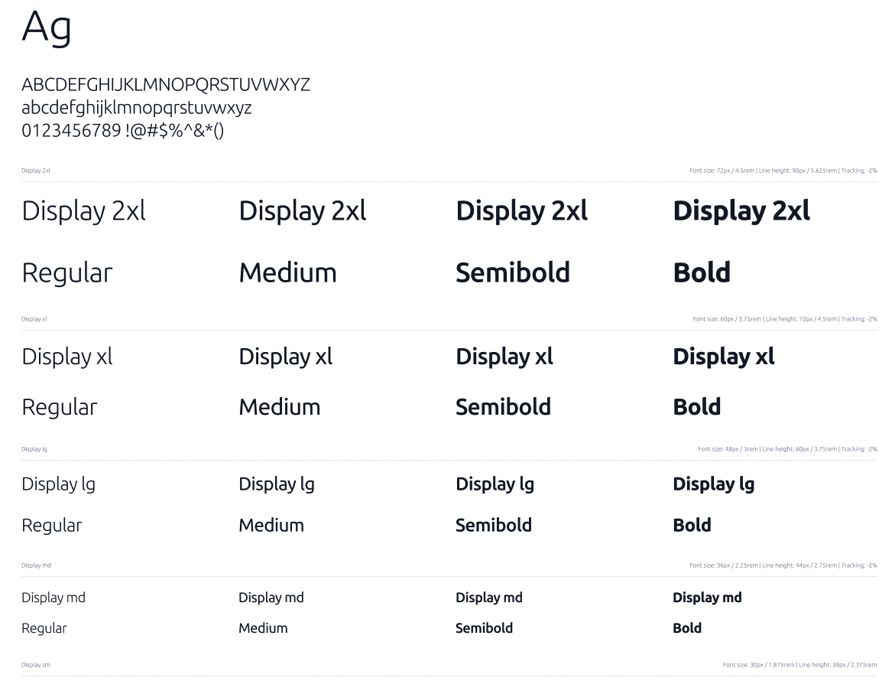
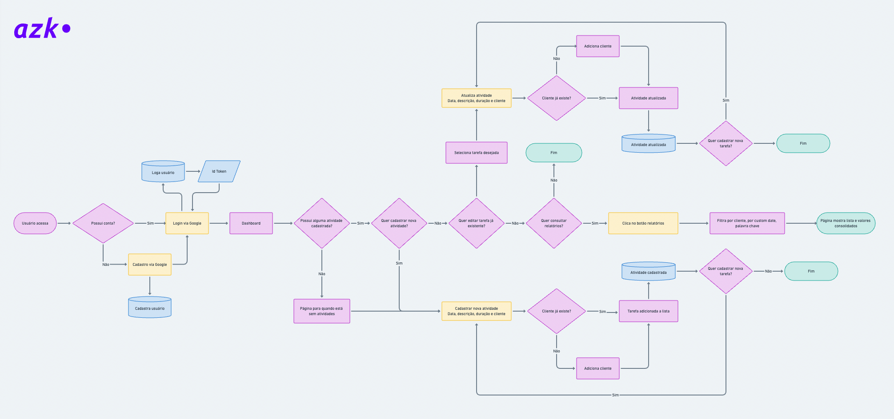
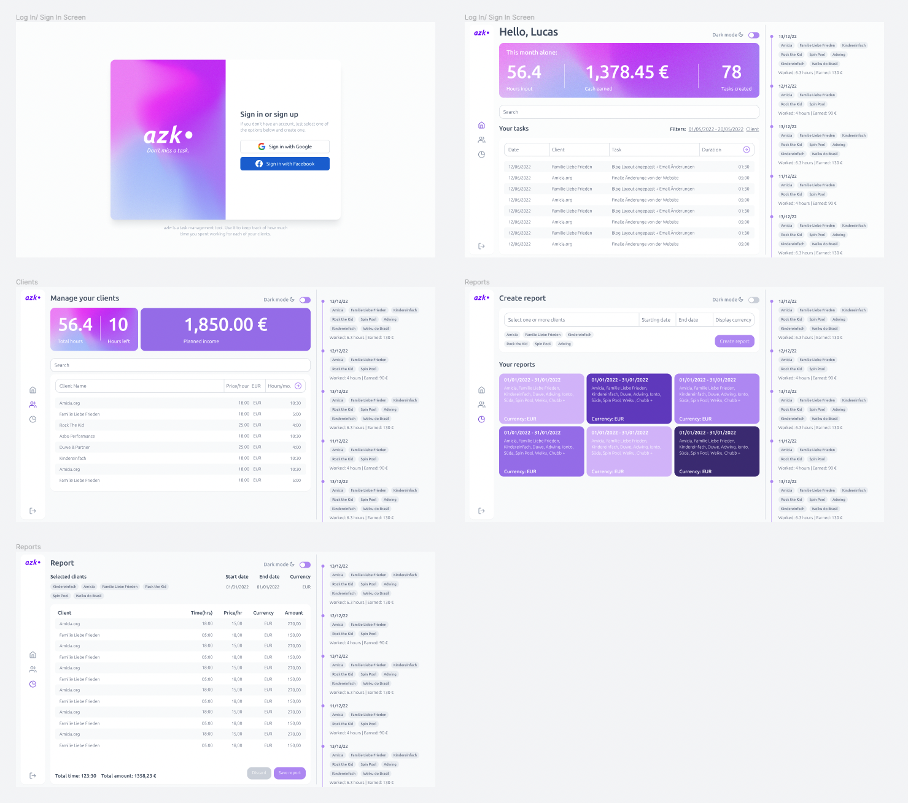

# <em>azk• Don't miss a task.</em>

###### AZK• is still a work in progress.

When you are a Freelancer working by the hour, you have to spend a lot of time inputting data, measuring  and anlyzing it. If you're in a team of Freelancers, things get even more complicated. If you are doing it in MS Excel, oh man. Aiming to reduce errors and time spent on task management, I created azk• (which is on its second version, already). The worst thing that can happen to a Freelancer is not getting paid for something she/he worked on. That happens quite frequently, depending on the environment.

## Creation and development

### Approaching the problem

Well, since the problem was mine and from other professionally close people, it was a little easier to make the reasearch and to discover new problems, than it usually is (also, since this is a small, non comercial project that will be used by few people). Here's a list of both things that have to be accomplished every month, regarding each client and task, and problems that were persistent:

#### Activities:
• Register new and existing clients, each with its available hours, payment and currency; 
• Register new individual tasks, each with its date, client, description and duration; 
• Analyse total hours, by client and date;

#### Common problems:
• Freelancers exceed the monthly workload allowed for each client; 
• Some tasks were left behind and not paid; 
• Information was lost; 

#### User behaviour:
• Used mostly on desktop PCs both by day and night times (I actually never input tasks from my phone); 
• Daily input of tasks; 
• Monthly hour and payment analysis (once per month); 

#### Branding (or a little bit of it)
I didn't design the brand as a whole, it is basically the logo, the color palette, the typography and a few graphic elements, just enough to make the application work as a simple (sort of MVP) product.

##### THE WHY
From a product development point of view, azk• is suposed to solve the following problems:
<ul>
  <li>Inputting tasks is boring and costs time (freelancing money);</li>
  <li>Errors when inputting data can lead to money lost (either from you or from the client);</li>
  <li>Retrieving input information is hard and error prone;</li>
</ul>
A freelancer should spend time doing things that deliver value and get paid for it.

##### THE HOW
Exploring the user behaviour and the problems they face, I could create a tailored experience, that sits on the bright, practical side of work: acomplishing things and getting paid for them. When we start planning things from our goals everything else just start making sense.

##### THE WHAT
azk• Don't miss a task. is a task management tool. Use it to keep track of how much time you spent working for each of your clients. The name comes from the German acronym to Arbeitszeitkarte, AZK, which translates to "daily job time report" or, more literally, "work time sheet".

### Designing the UX and UI
After listing down the core features based on the activities and common problems, they were hierarchically organized, prioritizing the features that were most commonly used and were the most important. After building the UX chartflow, I was able to identify probable misuses and improvements iteratively. This is the final result:

#### The UI
After breaking down the UX flow into the core features, I was able to decide how to group the functionalities into pages and elements.

