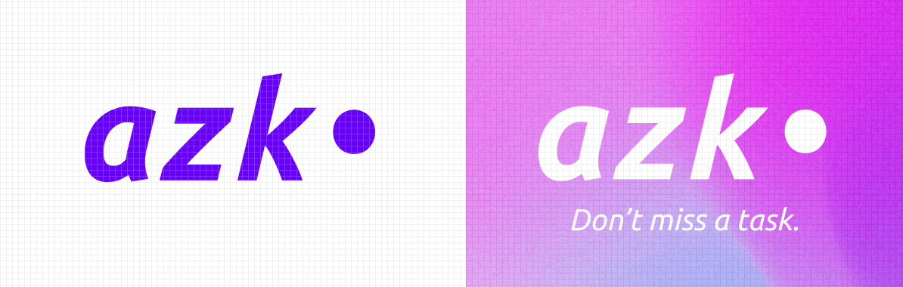
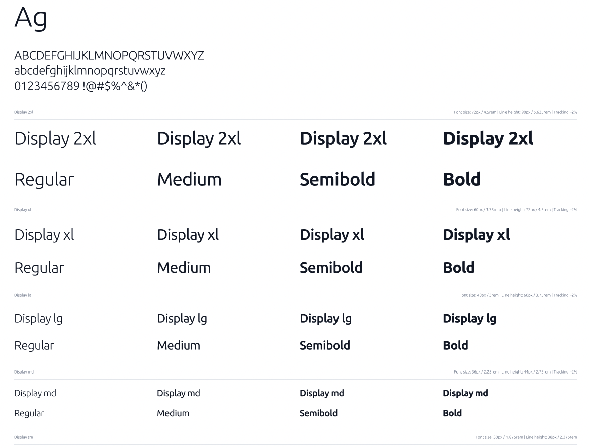
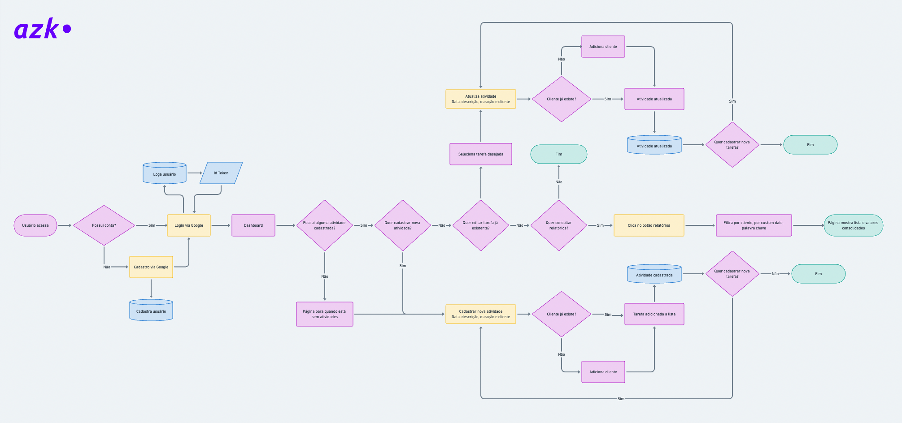
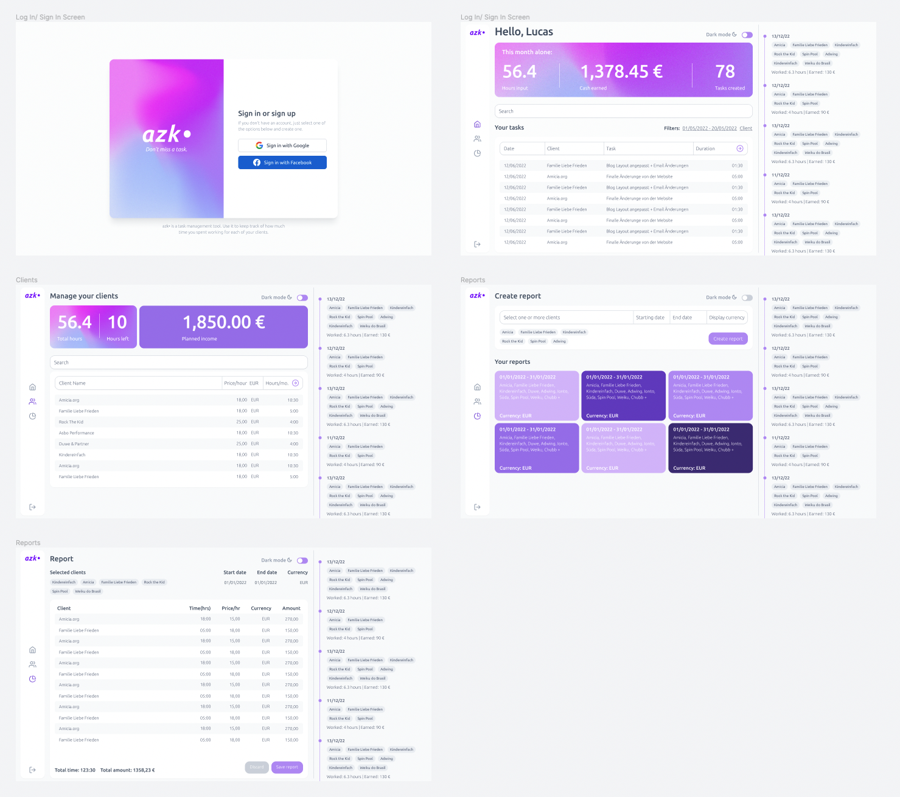

# <em>azk• Don't miss a task.</em>

###### AZK• is still a work in progress.

**Live project:** https://azk-manager.netlify.app

When you are a freelancer working by the hour, you have to spend a lot of time inputting data, measuring it, and analyzing it. If you're in a team of freelancers, things get even more complicated. If you are doing it in MS Excel, oh man.

Aiming to reduce errors and time spent on task management, I created azk•, which is already in its second version. The worst thing that can happen to a freelancer is not getting paid for something she/he worked on. That happens quite frequently, depending on the environment.

## Creation and development

### Approaching the problem

Well, since the problem was mine and came from other professionally close people, it was a little easier to research and discover new problems than it usually is. Also, since this is a small, non-commercial project that will be used by few people, the research was more direct and practical.

Here's a list of things that have to be accomplished every month, regarding each client and task, and problems that were persistent:

#### Activities:

• Register new and existing clients, each with its available hours, payment, and currency;<br>
• Register new individual tasks, each with its date, client, description, and duration;<br>
• Analyze total hours by client and date;<br>
• Review monthly reports and payment information;<br>

#### Common problems:

• Freelancers exceed the monthly workload allowed for each client;<br>
• Some tasks are left behind and not paid;<br>
• Information gets lost;<br>
• Monthly analysis becomes more complicated than it should be;<br>

#### User behaviour:

• Used mostly on desktop PCs, both during day and night work sessions;<br>
• Daily input of tasks;<br>
• Monthly hour and payment analysis;<br>
• Reports are usually reviewed at the end of each month;<br>

#### Branding (or a little bit of it)

I didn't design the brand as a whole. It is basically the logo, the color palette, the typography, and a few graphic elements, just enough to make the application work as a simple MVP-style product.

##### THE WHY

From a product development point of view, azk• is supposed to solve the following problems:

<ul>
  <li>Inputting tasks is boring and costs time, which means freelancing money;</li>
  <li>Errors when inputting data can lead to money lost, either from you or from the client;</li>
  <li>Retrieving input information is hard and error-prone;</li>
  <li>Monthly analysis should not depend on fragile spreadsheets;</li>
  <li>Freelancers need to know whether they are still inside each client's agreed workload;</li>
</ul>

A freelancer should spend time doing things that deliver value and get paid for it.

##### THE HOW

Exploring the user behaviour and the problems they face, I could create a tailored experience that sits on the bright, practical side of work: accomplishing things and getting paid for them.

When we start planning things from our goals, everything else starts making sense. In this case, the goal was simple: make completed work easier to register, retrieve, review, and charge for.

##### THE WHAT

azk• Don't miss a task. is a task-management and time-tracking tool.

Use it to keep track of how much time you spend working for each of your clients, organize tasks, and review monthly work through reports.

The name comes from the German term `Arbeitszeitkarte`, abbreviated as `AZK`, which translates to "daily job time report" or, more literally, "work time sheet".





### Designing the UX and UI

After listing down the core features based on the activities and common problems, they were hierarchically organized, prioritizing the features that were most commonly used and the most important.

After building the UX flowchart, I was able to identify probable misuses and improvements iteratively. This is the final result:



#### The UI

After breaking down the UX flow into the core features, I was able to decide how to group the functionalities into pages and elements.

The current version includes screens for login, dashboard, clients, tasks, reports, and report details.



## Current features

<ul>
  <li>Login screen prototype;</li>
  <li>Dashboard overview;</li>
  <li>Client list;</li>
  <li>Task list;</li>
  <li>Report list;</li>
  <li>Report detail page;</li>
  <li>Shared app data through React context;</li>
  <li>Mock data for prototype usage;</li>
  <li>Animated route transitions;</li>
  <li>Reusable UI components;</li>
  <li>Responsive interface foundation;</li>
</ul>

## Tech stack

<ul>
  <li>React 18;</li>
  <li>Vite;</li>
  <li>React Router;</li>
  <li>Framer Motion;</li>
  <li>Tailwind CSS;</li>
  <li>JavaScript;</li>
  <li>Vitest;</li>
  <li>jsdom;</li>
  <li>Netlify;</li>
</ul>

## Technical implementation

The project was migrated to a modern Vite-based setup.

The application uses React Router to organize the main product areas into separate routes, including dashboard, clients, tasks, reports, and report details.

Shared prototype data is handled through a React context provider. This keeps the app structure closer to how a real product could evolve, even though the current version still uses mock data instead of a backend.

Framer Motion is used for route and page transitions, giving the interface a more polished product feel without adding unnecessary complexity.

The UI is split into reusable components such as cards, buttons, form fields, search bars, menus, badges, section headers, and timeline elements.

## Running the project

Clone the repository:

```bash
git clone https://github.com/lucas-bids/azk-2.git
cd azk-2
````

Install dependencies:

```bash
npm install
```

Run the development server:

```bash
npm run dev
```

Build the project:

```bash
npm run build
```

Preview the production build:

```bash
npm run preview
```

Run tests:

```bash
npm test
```

Run tests in watch mode:

```bash
npm run test:watch
```

## Status

AZK• is a prototype and portfolio project.

The current version focuses on product concept, interface structure, routing, reusable components, and mock-data workflows. It does not yet include a production backend, authentication, or persistent user data.

## Future improvements

<ul>
  <li>Add persistent storage;</li>
  <li>Add real authentication;</li>
  <li>Add client creation and editing;</li>
  <li>Add task creation and editing;</li>
  <li>Add monthly reports based on real task data;</li>
  <li>Add filtering by client, date, and payment status;</li>
  <li>Add currency and invoice calculations;</li>
  <li>Add export options for reports;</li>
  <li>Improve mobile responsiveness;</li>
  <li>Add automated tests for task and report logic;</li>
  <li>Connect the app to a backend or database;</li>
</ul>

## About

AZK• is a product-oriented front-end prototype built around a real freelance workflow problem.

It reflects my interest in building practical tools that reduce friction, prevent operational mistakes, and help people work with more clarity.

```
```
